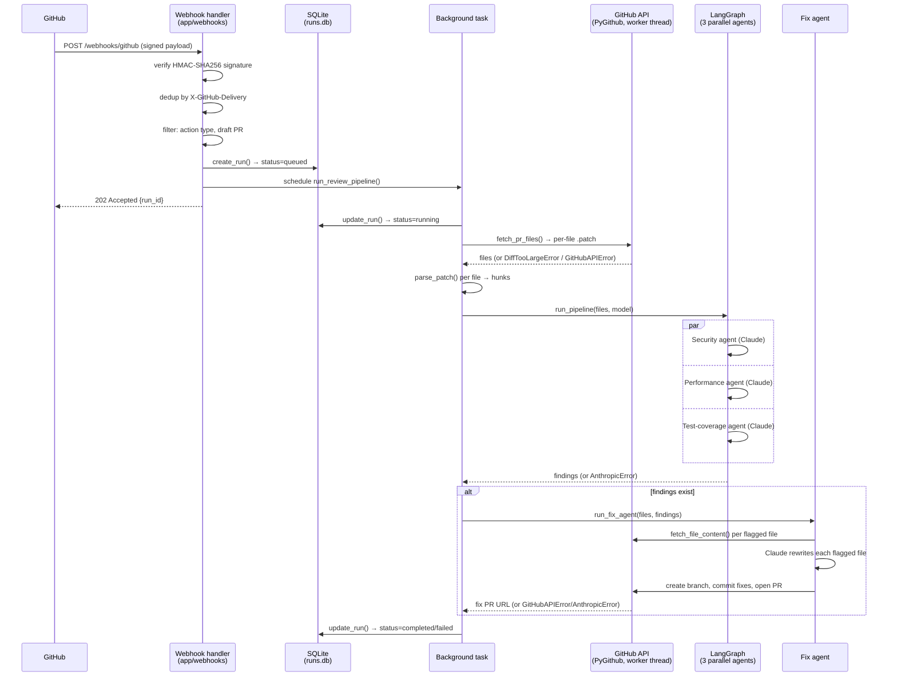
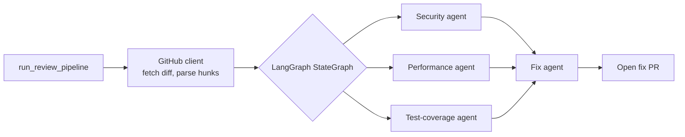

# AI Code Review Agent (with Auto-Fix)

Connects to GitHub PRs, runs parallel Security / Performance / Test-coverage
review agents (Claude + LangGraph), and opens a second PR with the actual
fix applied — no back-and-forth comments.

## Status

| Step | What | State |
|---|---|---|
| 1 | FastAPI webhook receiver (HMAC verification, dedup, dispatch) | ✅ Done |
| 1a | Run-history persistence (SQLite) + dashboard UI | ✅ Done |
| 2 | GitHub client: fetch PR diff, parse into hunks | ✅ Done |
| 3 | LangGraph StateGraph: parallel Security/Performance/Test agents | ✅ Done |
| 4 | Fix Agent: generate patch, open fix PR | ✅ Done |
| 5 | Demo repo + seed script for the Instagram clip | ✅ Done |

All five steps are implemented. See [Known limitations](#known-limitations)
for the gaps worth knowing about before relying on this beyond a demo.

## Architecture

**Request flow** — a webhook comes in, gets validated and recorded, control
returns to GitHub before any slow work happens, and the background task
runs the full pipeline: fetch the diff (Step 2), review it with three
parallel Claude agents (Step 3), and — if they found anything — generate
and open a fix PR (Step 4):



The 202 must go out within GitHub's ~10s delivery window, so nothing
slow (diff fetch, Claude calls, PR creation) may block the handler —
that's why dispatch happens via `BackgroundTasks` and the pipeline is a
separate, swappable function. PyGithub itself is synchronous, so its calls
run in a worker thread (`asyncio.to_thread`) rather than blocking the event
loop that also serves `/health` and `/dashboard`.



Two error-handling choices worth calling out:

- A review agent only ever raises on a real API failure (bad key, rate
  limit, network) — a single malformed JSON response from Claude is caught
  and treated as "no findings" for that agent alone, so one flaky response
  doesn't take down the other two agents or the whole run. An actual API
  failure, by contrast, is deliberately *not* swallowed: reporting "no
  issues found" when the security agent never actually ran would be
  actively misleading, so those propagate and the run is marked `failed`.
- A fix-agent failure, by contrast, does **not** fail the run — the review
  already succeeded and its findings are the primary value; the fix PR is
  best-effort on top. If it fails, the run stays `completed` with the real
  findings intact, `fix_pr_url` left null, and the error recorded under
  `findings.fix_error`.

### Project layout

```
app/
  main.py              FastAPI app: wires up all routers
  config.py            Settings (env-var backed, validated at import time)
  db.py                SQLite connection + schema
  webhooks/
    github_webhook.py  POST /webhooks/github — signature check, dedup,
                        filtering, and the run_review_pipeline() orchestrator
    schemas.py          Pydantic models for the subset of the GitHub
                        pull_request payload the app actually uses
  services/
    runs.py             CRUD over the `runs` table (create/update/list/get)
  api/
    runs.py             GET /runs, GET /runs/{id} — read-only run history
  web/
    dashboard.py         GET /dashboard — serves the HTML below
    templates/
      dashboard.html      Self-contained page, polls /runs client-side
  github_client/
    client.py             fetch_pr_files(), fetch_file_content(), open_fix_pr() —
                           PyGithub, run in a worker thread; raise
                           DiffTooLargeError/GitHubAPIError
    diff_parser.py         parse_patch() — turns one file's unified-diff
                           patch into structured, line-addressable hunks
  agents/
    graph.py               LangGraph StateGraph — fans out to the 3 review agents,
                           fans their findings back in via run_pipeline()
    claude_client.py        review() — one Claude call + JSON-to-Finding parsing,
                           shared by all 3 review nodes
    fix.py                  run_fix_agent() — regenerates each flagged file with
                           Claude, then opens the fix PR via the GitHub client
    models.py               Finding — the shared pydantic schema every review agent returns
  prompts/
    review_prompts.py       System prompts for Security/Performance/Test-coverage,
                           plus build_diff_context() to render files for Claude
    fix_prompts.py           System prompt + per-file user message for the fix agent
tests/
  test_webhook.py        Signature, dedup, draft-skip, ping, happy-path coverage
  test_github_client.py  fetch_pr_files/fetch_file_content/open_fix_pr (mocked)
  test_diff_parser.py    parse_patch: hunk headers, add/remove/context lines
  test_claude_client.py  review(): well-formed/malformed/schema-invalid responses (mocked)
  test_agents_graph.py   run_pipeline: all 3 agents invoked, findings routed correctly
  test_review_prompts.py build_diff_context: patch inclusion, binary-file skipping
  test_fix_agent.py      run_fix_agent: no-findings no-op, file-update generation,
                          defensive skip of out-of-diff files (mocked)
  fixtures/               Sample GitHub webhook payloads
demo/
  seed/
    app_before.py           Clean baseline "user lookup" endpoint, seeded onto main
    app_after_vulnerable.py The PR version with an intentional SQL-injection bug
scripts/
  seed_demo_pr.py         Step 5 — seeds demo/seed/'s two files into GITHUB_REPO
                           and opens the PR the recorded demo reviews (idempotent)
Dockerfile / docker-compose.yml   Container build + local compose stack
```

## Setup

```bash
python -m venv .venv && source .venv/bin/activate   # Windows: .venv\Scripts\activate
pip install -r requirements.txt
cp .env.example .env   # fill in GITHUB_TOKEN, GITHUB_WEBHOOK_SECRET, ANTHROPIC_API_KEY
```

### Configuration (`.env`)

| Variable | Required | Default | Purpose |
|---|---|---|---|
| `GITHUB_TOKEN` | yes | — | PAT with repo contents + pull-requests read/write (full `repo` scope if you'll also run `scripts/seed_demo_pr.py`) |
| `GITHUB_WEBHOOK_SECRET` | yes | — | Must match the secret set on the GitHub webhook |
| `GITHUB_REPO` | yes | — | `owner/repo` of the demo repo being watched |
| `ANTHROPIC_API_KEY` | yes | — | Claude API key for the review/fix agents |
| `CLAUDE_MODEL` | no | `claude-sonnet-5` | Model used by the review/fix agents |
| `MAX_DIFF_BYTES` | no | `200000` | Diffs larger than this get a comment instead of a full review |
| `LOG_LEVEL` | no | `INFO` | Python logging level |
| `DB_PATH` | no | `runs.db` | SQLite file backing the run-history dashboard |

All four required vars are validated by `pydantic-settings` at import
time (`app/config.py`), so a missing/malformed value fails fast on
startup rather than deep inside a request handler.

## Run locally

```bash
uvicorn app.main:app --reload
# or
docker compose up --build
```

- Health check: `GET http://localhost:8000/health`
- Interactive API docs: `GET http://localhost:8000/docs`

## Run history dashboard

Every accepted webhook is recorded as a run in SQLite (`DB_PATH`, default
`runs.db`): repo, PR, action, status (`queued → running → completed/failed`),
findings, and fix-PR URL once those exist.

- Dashboard: `GET http://localhost:8000/dashboard` — auto-refreshing table
- API: `GET /runs` (list, newest first, `?limit=`) and `GET /runs/{id}` (404 if missing)

Every run carries real findings: `findings.review.{security,performance,test}`
(each a list of `{file, line, severity, message, suggestion}`) plus a
`diff_summary`, and `fix_pr_url` once the fix agent has opened its PR. A
run is marked `failed` (with the real error) if the diff is too large,
GitHub rejects the fetch, or the review agents' Claude calls fail — never
silently reported as "no issues found". A fix-agent failure is softer: the
run still shows `completed` with the review findings intact, `fix_pr_url`
null, and the error under `findings.fix_error`.

## Running the demo end to end

1. Point a real GitHub webhook at your local server:
   - Expose it: `ngrok http 8000`
   - In your demo repo: Settings → Webhooks → Add webhook
     - Payload URL: `https://<ngrok-id>.ngrok.io/webhooks/github`
     - Content type: `application/json`
     - Secret: same value as `GITHUB_WEBHOOK_SECRET` in `.env`
     - Events: just the "Pull requests" event
2. Seed the demo PR: `python scripts/seed_demo_pr.py`. This pushes
   `demo/seed/app_before.py` to the repo's default branch, then opens a PR
   (`feature/user-lookup` → default branch) with
   `demo/seed/app_after_vulnerable.py`'s SQL-injection bug for the review
   agents to catch. It's idempotent — re-run it as many times as you need
   while rehearsing a recording; it reuses whatever's already there instead
   of failing.
3. Watch it happen: a 202 in the ngrok inspector, log lines in the FastAPI
   console, and — once the review and fix agents finish — a new row on
   `/dashboard` with real findings and a link to the fix PR.

`scripts/seed_demo_pr.py` needs `GITHUB_TOKEN` to have the `repo` scope
(broader than the contents+pull-requests scope the running app needs),
since it can create the repo itself if `GITHUB_REPO` doesn't exist yet.

## Tests

```bash
pytest tests/ -v
```

Covers webhook auth/dedup/filtering, the GitHub diff client (including the
fix-agent's file-content/branch/PR calls), the diff parser, the Claude
response parsing, the LangGraph orchestration, and the fix agent — all
mocked, no real API calls in the suite; see `_stub_github_diff_fetch` in
`test_webhook.py` for how the webhook tests stay offline.
`scripts/seed_demo_pr.py` is a one-off setup tool rather than app
behavior, so it isn't part of this suite.

## Known limitations

The whole pipeline (Steps 1-5) runs end to end for real: the webhook
receiver, the run-history dashboard, the GitHub diff client, the three
parallel Claude review agents, and the fix agent that opens a PR with the
fix applied. A few gaps are still worth knowing about before relying on
this beyond a demo:

- **Dedup is in-memory** (`_seen_delivery_ids` in `github_webhook.py`) —
  process-local, so it silently stops working the moment you run more than
  one worker/replica. Swap for Redis `SETNX` with a TTL first.
- **Fix-agent branch names can collide on re-review of the same commit.**
  `run_fix_agent` names its branch `bot/fix-pr-{number}-{head_sha[:7]}`; if
  the exact same commit is reviewed twice (e.g. `opened` then `reopened`
  with no new push), the second run's branch-creation call fails and that
  run records the collision under `findings.fix_error` rather than opening
  a duplicate PR silently.
- **The fix agent rewrites whole files, not surgical patches.** For a
  large file this costs more tokens than a targeted diff and risks hitting
  `max_tokens` (8192) on the response; fine for the demo's small target
  files, worth revisiting before pointing this at a large real codebase.
- **No `.gitignore` yet** and the project isn't a git repo — before
  initializing one, exclude `.venv/`, `.env`, `runs.db`, and `__pycache__/`.
